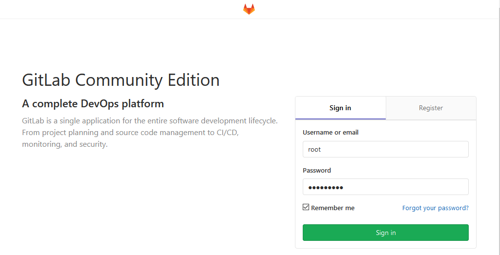
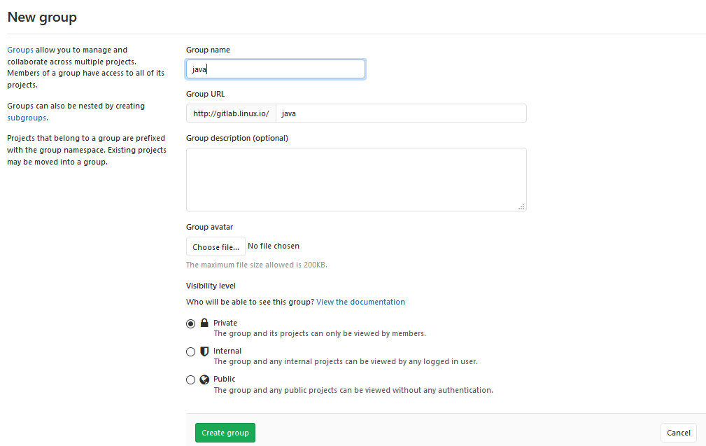

##　Gitlab Community Edition 镜像使用帮助

####　RHEL/CentOS 用户

新建 /etc/yum.repos.d/gitlab-ce.repo，内容为

```
cat > /etc/yum.repos.d/gitlab-ce.repo << EOF
[gitlab-ce]
name=Gitlab CE Repository
baseurl=https://mirrors.tuna.tsinghua.edu.cn/gitlab-ce/yum/el7/
gpgcheck=0
enabled=1
EOF
```

再执行：`yum install gitlab-ce`

#### 配置访问地址

```
~]# vim /etc/gitlab/gitlab.rb
external_url 'http://gitlab.linux.io'
nginx['listen_port'] = 80
```
#### 重启配置和启动

```
~]# gitlab-ctl reconfigure
~]# gitlab-ctl restart
```
#### 登陆web

> 第一次登陆要设置root管理员密码



#### 添加组、创建项目、创建用户

**1. 创建组**

> 使用管理员 root 创建组、一个组里面可以有多个项目分支，可以将开发添加到组里面设置权限，不同组就是公司不同的开发项目或者服务模块，不同组添加不同的开发即可实现对开发设置权限管理



**2. 创建项目**
